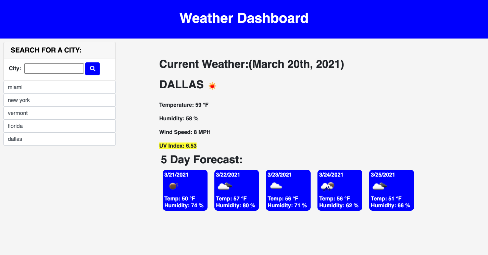

# Weather-Dashboard-App

1. [ Description. ](#desc)
2. [ Web Address. ](#web-address)
3. [ Contributions. ](#contributions)

## 1. Description

I created an application that allows a user to see the weather outlook for multiple cities so they can plan a trip accordingly
When the application is opened you see an input form asking to input city to search. after clicking search icon or enter button, user is am presented with current and future conditions for that city and that city is added to the search history. 
When user views current weather conditions for that city
they are presented with the city name, the date, an icon representation of weather conditions, the temperature, the humidity, the wind speed, and the UV index
When use views UV Index, they are with a color that indicates whether the conditions are favorable, moderate, or severe.
If User views the future weather conditions for that city
they are presented with a 5-day forecast that displays the date, an icon representation of weather conditions, the temperature, and the humidity
Finally when user clicks on a city in the search history
they are again presented with current and future conditions for that city.

## 2. How to Get There

### Click link to open in your browser.

[github pages site] https://jbarbss.github.io/Weather-Dashboard-App/

[github repository site] https://github.com/Jbarbss/Weather-Dashboard-App

### Deployed application screen shot

## 3. Contributions
Thank you to the following for their suggestions and insights.

Ben Durham

Patrick Walker

Gabe Thomas

Takuya Matsumoto
